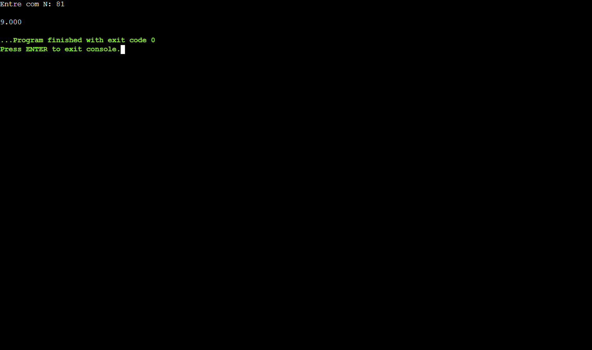

<h1 align="center"> Projeto C - Função Raiz Quadrada </h1>

Projeto em Linguagem C durante o curso Análise e Desenvolvimento de Sistemas pela Fatec Ipiranga.

---

 

  

---
## 💻 Tecnologias

Esse projeto foi desenvolvido com as seguintes tecnologias:

- Linguagem C
- Git e Github

---

## 🚧 Projeto

Por meio de uma função, o usuário consegue digitar qualquer número, e o Programa chamará a função e retornará o resultado da Raiz Quadrada do Número Digitado.

Você pode ver o Projeto e testar neste link: [Função Raiz Quadrada - C](https://onlinegdb.com/eYkA_FhS0)

--- 
